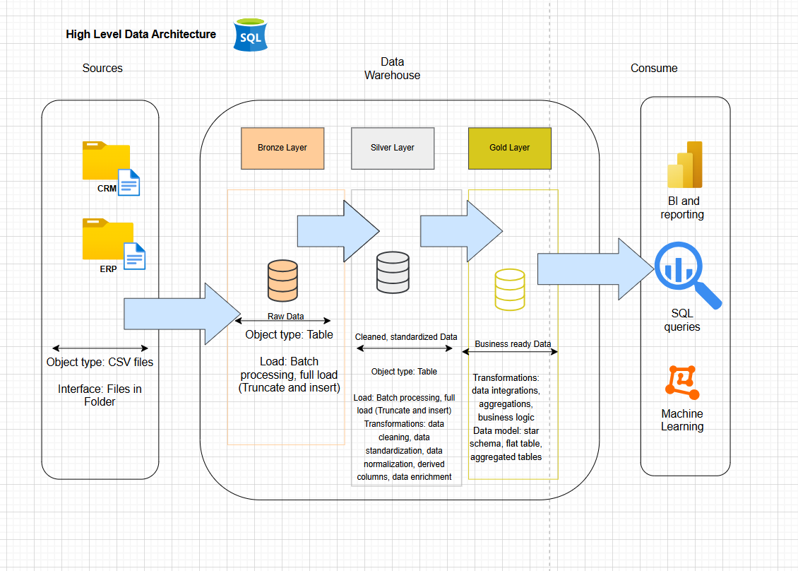
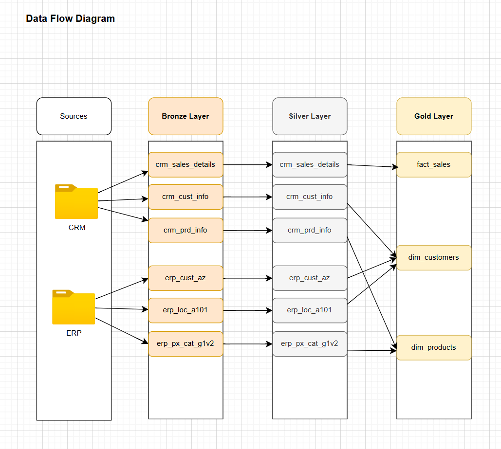

# 🧱 Modern Data Warehouse Project

**Building a modern data warehouse with SQL Server, including ETL processes, data modelling, and analytics.**  
This repository demonstrates an end-to-end data warehousing solution using SQL Server — from raw source data to a cleaned, analytics-ready model.

---

## 🚀 Project Overview

This project showcases:

- A **scalable data warehouse** built using SQL Server
- Robust **ETL processes** to extract, transform, and load data
- A **star schema data model** optimized for analytics
- SQL-based reporting and insights

---

## 🏗️ Architecture & Data Flow

Below diagrams visualize the core pipeline and schema:

### 📊 Data Architecture Diagram  

### 🔄 ETL Pipeline Flow  

---

## 🛠️ Tech Stack

This project uses:

- **SQL Server** (Database engine)  
- **T-SQL** (for transformations & schema creation)  
- **ETL Scripts** (SQL scripts or Python if applicable)  
- **Diagrams created with draw.io / diagrams.net**  
- **Git & GitHub** for version control

---

## 📁 Repository Structure

├── datasets/ ← raw source files
├── docs/ ← diagrams & documentation
├── scripts/ ← ETL scripts
├── tests/ ← unit or integration tests
├── README.md ← this file
├── LICENSE ← MIT License
